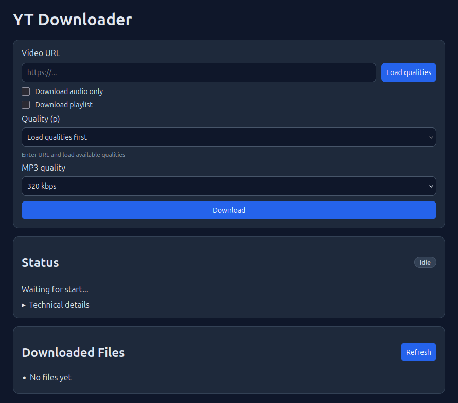

# yt-dlp YouTube Video Downloader Web UI (Flask)

A simple YouTube video downloader web UI built with Flask using yt-dlp.  
Download YouTube videos in your browser by URL with selectable quality and best available audio — no transcoding required.



## Features
- Web page with a URL field and download button
- Dynamic quality selection by available resolutions (e.g. 360p, 720p, 1080p)
- Download of selected video quality with best available audio track
- Playlist support: full videos or audio-only MP3 downloads
- Audio-only MP3 download with selectable bitrate `192` or `320 kbps`
- API for starting downloads and checking status
- List of downloaded files from the `downloads/` folder
- Single local Flask process

## Requirements
- Python 3.10+ is required (must be available in PATH)
- `pip` for installing dependencies
- `ffmpeg` for best quality video+audio merge

If you do not have these installed yet:

Linux (APT):

```bash
sudo apt update
sudo apt install -y python3 python3-venv python3-pip git ffmpeg
```

macOS (Homebrew):

```bash
brew install python git ffmpeg
```

Windows (PowerShell):

```powershell
winget install --id Python.Python.3.12 -e
winget install --id Git.Git -e
winget install --id Gyan.FFmpeg -e
```

Make sure Python is added to `PATH` during installation.

## Quick Start

1. Clone the repository.

2. Create virtual environment and install dependencies.

Linux/macOS:
```bash
python3 -m venv .venv
source .venv/bin/activate
pip install -r requirements.txt
```

Windows PowerShell:
```powershell
py -m venv .venv
.\.venv\Scripts\Activate.ps1
pip install -r requirements.txt
```

3. Install ffmpeg.

Linux (APT):

```bash
sudo apt update
sudo apt install -y ffmpeg
```

Windows (winget):

```powershell
winget install --id Gyan.FFmpeg -e
```

4. Run the app.

Linux/macOS:
```bash
python3 run.py
```

Windows PowerShell:
```powershell
py run.py
```

5. Open in browser:

```
http://127.0.0.1:5000
```

## Download Flow
1. Paste a video URL.
2. Click **Load qualities** to fetch available formats.
3. Select quality (`###p`) from the dropdown.
4. Click **Download** and track status.
